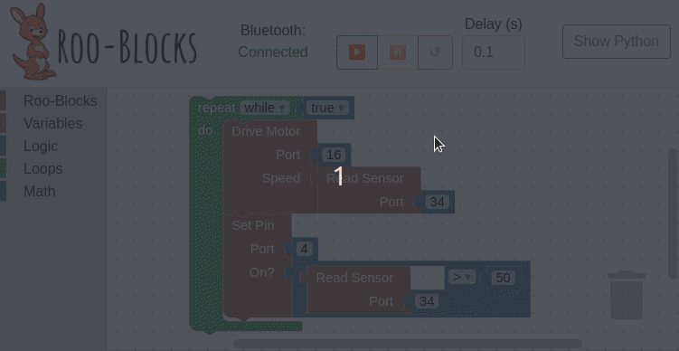

Companion app:


Program executing over bluetooth:


# Installation

Download and install the conda package manager.

## Install dev environment

Run these commands to install all app dependencies.

```bash
conda env update -f environment.yml
conda activate roo-blocks
cd app && npm i
```

Ensure that you always activate the `roo-blocks` environment before you do anything else:

```bash
conda activate roo-blocks
```

## Give script bluetooth access

```bash
cd app
sudo setcap cap_net_raw+eip bluetooth.py
```

## Flashing the ESP32

If on linux, you need full r/w access to usb serial. Add yourself with:

```bash
sudo adduser <USER> dialout
```

Replace serial port below.
For Windows this will look like COM12 found in windows device manager.
For linux this will look like ttyUSB0.

```bash
cd controller
esptool --port /dev/ttyUSB0 erase_flash
esptool --port /dev/ttyUSB0 write_flash -z 0x1000 esp32-idf4-v1.12.bin
```

## Uploading main.py

```bash
cd controller
ampy
```

# Running the App

In order to utilise local ble devices, the script either needs to be run with `sudo` or capabilities granted to `node` with:

```bash
sudo setcap cap_net_raw+eip $(readlink -f $(which node))
```

Unfortunately granting capabilities to a `conda` binary will [break it's ability to resolve dynamic libraries, such as libnode.so](https://github.com/conda/conda/issues/8984).
